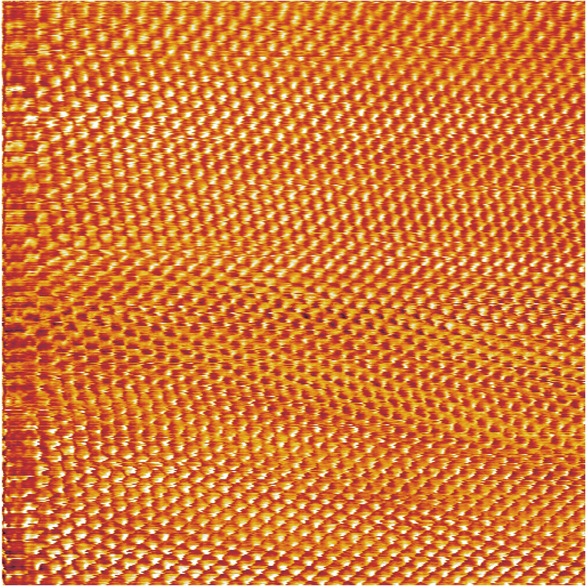

这个项目是机械小熊猫的扫描隧道显微(STM)设计，包括了 Fusion360 文件，PCB 工程文件，C++文件还有用来控制 STM 的 Python 软件。

这是世界上第一台以 FDM 3D 打印件为主要结构件的 STM 设计。它的扫描分辨率可以达到原子级别。

_小熊猫的 STM 拍摄的石墨表面的碳原子照片，显示出石墨表面碳原子的六边形结构_

目前暂时没有详细的制作教程，整个项目介绍可以参考小熊猫在 B 站上的视频
[【硬核】我用 3D 打印的 STM 看到了碳原子 自制扫描隧道显微镜【终】](https://www.bilibili.com/video/BV1p94y1z7jX/?share_source=copy_web&vd_source=77fd182a5182be115284bbe426944568)

项目的总体设计和灵感主要参考了 Dan Berard 的自制 STM 项目（https://dberard.com/home-built-stm/）

_STM 的 CAD 文件，包括 STM 本体和减震平台_

TODO: 增加 BOM 表
